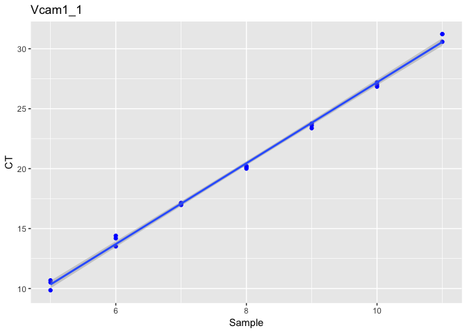

Primer Efficiency
================
Hanne Grosemans

\#Load packages

``` r
library(tidyverse)
```

    ## Registered S3 methods overwritten by 'ggplot2':
    ##   method         from 
    ##   [.quosures     rlang
    ##   c.quosures     rlang
    ##   print.quosures rlang

    ## ── Attaching packages ──────────────────────────────────────────────────────────────────────────────── tidyverse 1.2.1 ──

    ## ✔ ggplot2 3.1.1     ✔ purrr   0.3.2
    ## ✔ tibble  2.1.1     ✔ dplyr   0.8.1
    ## ✔ tidyr   0.8.3     ✔ stringr 1.4.0
    ## ✔ readr   1.3.1     ✔ forcats 0.4.0

    ## ── Conflicts ─────────────────────────────────────────────────────────────────────────────────── tidyverse_conflicts() ──
    ## ✖ dplyr::filter() masks stats::filter()
    ## ✖ dplyr::lag()    masks stats::lag()

``` r
library(ggplot2)
library(readxl)
library(qPCRanalysis)
library(ggpubr)
```

    ## Loading required package: magrittr

    ## 
    ## Attaching package: 'magrittr'

    ## The following object is masked from 'package:purrr':
    ## 
    ##     set_names

    ## The following object is masked from 'package:tidyr':
    ## 
    ##     extract

``` r
library(lazyeval)
```

    ## 
    ## Attaching package: 'lazyeval'

    ## The following objects are masked from 'package:purrr':
    ## 
    ##     is_atomic, is_formula

``` r
library(broom)
```

\#Load
excelfile

``` r
qpcr <- read_excel("Primer_Eff_Test.xls", col_names = TRUE, sheet = 3, skip = 35)
head(qpcr)
```

    ## # A tibble: 6 x 38
    ##    Well `Well Position` Omit  `Sample Name` `Target Name` Task  Reporter
    ##   <dbl> <chr>           <lgl> <chr>         <chr>         <chr> <chr>   
    ## 1     1 A1              FALSE 05            Vcam1 1       UNKN… SYBR    
    ## 2     2 A2              FALSE 05            Vcam1 1       UNKN… SYBR    
    ## 3     3 A3              FALSE 05            Vcam1 1       UNKN… SYBR    
    ## 4     4 A4              FALSE 06            Vcam1 1       UNKN… SYBR    
    ## 5     5 A5              FALSE 06            Vcam1 1       UNKN… SYBR    
    ## 6     6 A6              FALSE 06            Vcam1 1       UNKN… SYBR    
    ## # … with 31 more variables: Quencher <chr>, CT <chr>, `Ct Mean` <dbl>, `Ct
    ## #   SD` <dbl>, Quantity <lgl>, `Quantity Mean` <lgl>, `Quantity SD` <lgl>,
    ## #   `Automatic Ct Threshold` <lgl>, `Ct Threshold` <dbl>, `Automatic
    ## #   Baseline` <lgl>, `Baseline Start` <dbl>, `Baseline End` <dbl>,
    ## #   Comments <lgl>, `Y-Intercept` <lgl>, `R(superscript 2)` <lgl>,
    ## #   Tm1 <dbl>, Slope <lgl>, Tm2 <lgl>, Efficiency <lgl>, Tm3 <lgl>,
    ## #   Custom1 <lgl>, Custom2 <lgl>, Custom3 <lgl>, Custom4 <lgl>,
    ## #   Custom5 <lgl>, Custom6 <lgl>, BADROX <chr>, HIGHSD <chr>,
    ## #   OUTLIERRG <chr>, EXPFAIL <chr>, PRFDROP <chr>

\#Select
columns

``` r
qpcr <- select(qpcr, c("Sample Name", "Target Name", "CT", "Tm1", "Tm2", "Tm3"))
colnames(qpcr) <- c("Sample", "Gene", "CT", "Tm1", "Tm2", "Tm3")
head(qpcr)
```

    ## # A tibble: 6 x 6
    ##   Sample Gene    CT                   Tm1 Tm2   Tm3  
    ##   <chr>  <chr>   <chr>              <dbl> <lgl> <lgl>
    ## 1 05     Vcam1 1 9.8553094863891602  78.3 NA    NA   
    ## 2 05     Vcam1 1 10.51309871673584   78.3 NA    NA   
    ## 3 05     Vcam1 1 10.680941581726074  78.3 NA    NA   
    ## 4 06     Vcam1 1 14.402891159057617  78.3 NA    NA   
    ## 5 06     Vcam1 1 14.18808650970459   78.3 NA    NA   
    ## 6 06     Vcam1 1 13.512539863586426  78.3 NA    NA

\#CT to numeric and remove undetermined

``` r
qpcr$CT <- as.numeric(qpcr$CT)
```

    ## Warning: NAs introduced by coercion

``` r
qpcr <- qpcr[ ! qpcr$Sample %in% "Blanc", ]
qpcr <- qpcr[rowSums(is.na(qpcr)) == 2,]
qpcr$Sample <- as.numeric(qpcr$Sample)
qpcr$Sample <- abs(qpcr$Sample)
qpcr$Gene <- gsub(pattern = " ", replacement = "_", x = qpcr$Gene)
qpcr
```

    ## # A tibble: 273 x 6
    ##    Sample Gene       CT   Tm1 Tm2   Tm3  
    ##     <dbl> <chr>   <dbl> <dbl> <lgl> <lgl>
    ##  1      5 Vcam1_1  9.86  78.3 NA    NA   
    ##  2      5 Vcam1_1 10.5   78.3 NA    NA   
    ##  3      5 Vcam1_1 10.7   78.3 NA    NA   
    ##  4      6 Vcam1_1 14.4   78.3 NA    NA   
    ##  5      6 Vcam1_1 14.2   78.3 NA    NA   
    ##  6      6 Vcam1_1 13.5   78.3 NA    NA   
    ##  7      7 Vcam1_1 17.0   78.3 NA    NA   
    ##  8      7 Vcam1_1 17.1   78.3 NA    NA   
    ##  9      7 Vcam1_1 17.1   78.3 NA    NA   
    ## 10      8 Vcam1_1 20.0   78.3 NA    NA   
    ## # … with 263 more rows

\#Plot

``` r
for(i in unique(qpcr$Gene)){
  print(qpcr %>% 
          filter(Gene == i) %>%
          ggplot(aes(x = Sample, y = CT)) + 
          geom_point(color = "blue") + 
          geom_smooth(method = "lm") +
          ggtitle(i))
}
```

<!-- --><!-- --><!-- --><!-- --><!-- --><!-- --><!-- --><!-- --><!-- --><!-- --><!-- --><!-- --><!-- -->

\#Linear model

``` r
slope <- list()
r2 <- list()
for(i in unique(qpcr$Gene)){
  temp <- NULL
  temp <- qpcr %>% filter(Gene == i)
  slope[[i]] <- coef(lm(CT ~ Sample, data = temp))[2]
  r2[[i]] <- as.double(summary(lm(CT ~ Sample, data = temp))[8])
}
slope <- as_tibble(slope)
slope <- as.matrix(slope)
slope <- t(slope)
slope <- as_tibble(slope, rownames = "Gene")
```

    ## Warning: `as_tibble.matrix()` requires a matrix with column names or a `.name_repair` argument. Using compatibility `.name_repair`.
    ## This warning is displayed once per session.

``` r
colnames(slope) <- c("Gene", "Slope")
r2 <- as_tibble(r2)
r2 <- as.matrix(r2)
r2 <- t(r2)
r2 <- as.tibble(r2, rownames = "Gene")
```

    ## Warning: `as.tibble()` is deprecated, use `as_tibble()` (but mind the new semantics).
    ## This warning is displayed once per session.

``` r
colnames(r2) <- c("Gene", "r2")
x = slope[,2] / 3.3333
x <- as.tibble(x)
colnames(x) <- "Efficiency"
x <- add_column(x, .before = "Efficiency", "Gene" = slope$Gene)
table <- full_join(x, r2, by = NULL, copy = FALSE)
```

    ## Joining, by = "Gene"

``` r
table <- na.omit(table)
```

\#Efficiency

``` r
mutate(table, Pass.Fail = ifelse((Efficiency >= 0.9 & Efficiency <= 1.1) & r2 >= 0.975, "Efficient", "Not efficient"))
```

    ## # A tibble: 13 x 4
    ##    Gene    Efficiency    r2 Pass.Fail
    ##    <chr>        <dbl> <dbl> <chr>    
    ##  1 Vcam1_1      1.01  0.997 Efficient
    ##  2 Vcam1_2      0.984 0.993 Efficient
    ##  3 Vcam1_3      0.975 0.997 Efficient
    ##  4 Sirt2_1      1.00  0.998 Efficient
    ##  5 Sirt2_2      1.05  0.998 Efficient
    ##  6 mTor_1       0.991 0.997 Efficient
    ##  7 mTor_2       1.02  0.999 Efficient
    ##  8 cScr_1       0.978 0.999 Efficient
    ##  9 cScr_2       1.04  0.993 Efficient
    ## 10 Pgc1a_1      1.03  0.995 Efficient
    ## 11 Pgc1a_2      0.992 0.998 Efficient
    ## 12 Nppb_1       1.02  0.997 Efficient
    ## 13 Nppb_2       0.993 0.998 Efficient
